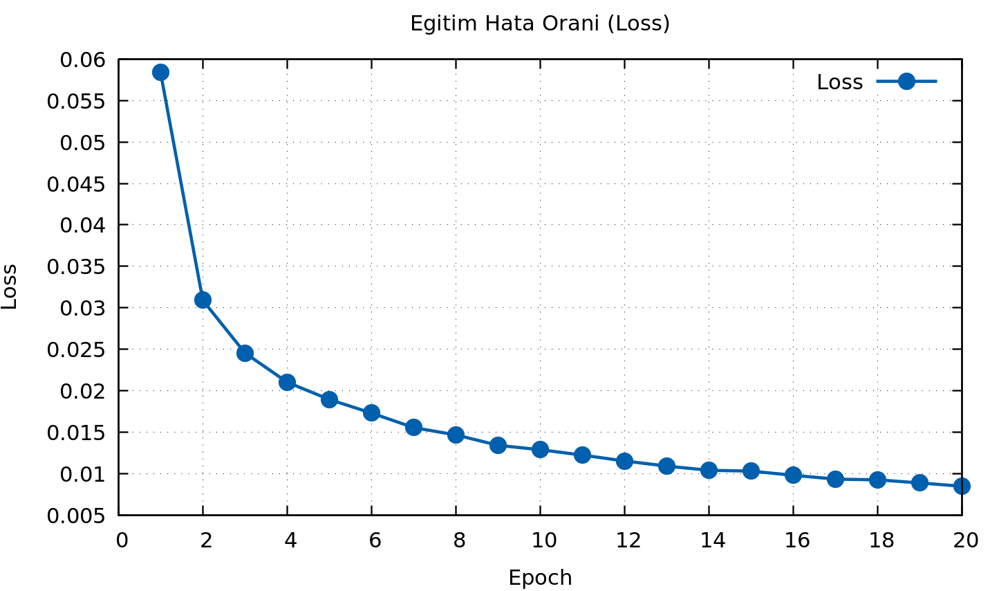
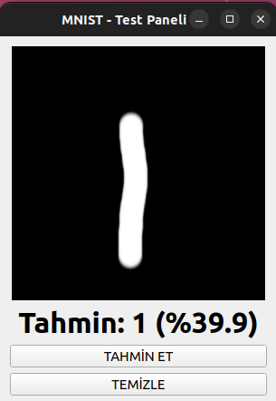
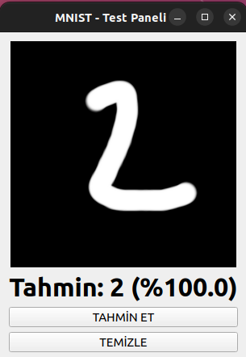
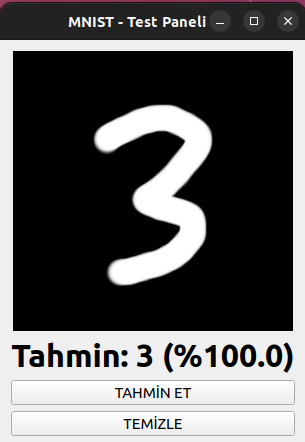
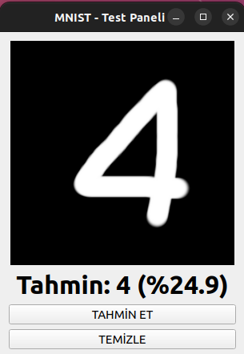
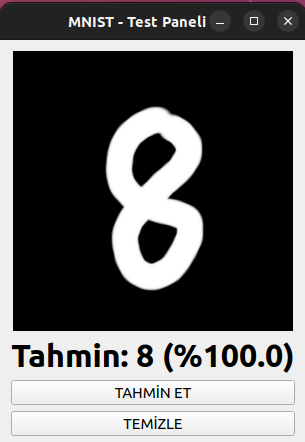
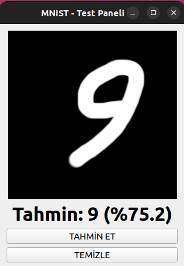

# NeuronLab - Yapay Sinir Ağı Simülasyonu


**NeuronLab**, C++ ve Qt Framework kullanılarak geliştirilmiş, grafiksel arayüze sahip profesyonel bir Yapay Sinir Ağı (ANN) simülasyon aracıdır. Kullanıcıların ağ topolojisini görselleştirmesine, eğitim sürecini (error graph) canlı takip etmesine ve sonuçları analiz etmesine olanak tanır.

---

##  Ekran Görüntüleri

<div align="center">
  
  <br><br>
  
  <br><br>
  
  <br><br>
  
  <br><br>
  
</div>

---

##  Özellikler

* **Görsel Ağ Yapısı:** Nöronları, katmanları ve sinaptik bağlantıları gerçek zamanlı grafiksel olarak render eder.
* **Canlı Eğitim Grafiği:** Hata oranının (loss) zamanla değişimini anlık grafik üzerinde gösterir.
* **Yüksek Performans:** C++ ve Qt altyapısı sayesinde optimize edilmiş hesaplama gücü.
* **Çapraz Platform:** Windows ve Linux (Ubuntu) üzerinde sorunsuz çalışır.
* **Kurulum Gerektirmez:** Portable (taşınabilir) yapıdadır; indirin ve direkt çalıştırın.

---

## 🧠 MNIST Dataset Benchmark & Test Results

NeuronLab, el yazısı rakam tanıma (MNIST) veri seti üzerinde test edilmiş ve yüksek doğruluk oranlarıyla doğrulanmıştır. Aşağıda, ağın eğitim sürecine dair kayıp (loss) grafiği ve farklı rakamlar üzerindeki çıkarım (inference) sonuçları yer almaktadır.

### Eğitim Performansı (Loss Graph)
Ağın öğrenme süreci boyunca hatanın (Error) minimize edilme aşaması aşağıda görselleştirilmiştir. Grafikteki düşüş, Backpropagation algoritmasının ve ağırlık güncellemelerinin kararlılığını göstermektedir.

<div align="center">
  
</div>

### Çıkarım (Inference) Örnekleri
Aşağıdaki tabloda, kullanıcı paneli üzerinden girilen farklı el yazısı rakamların, eğitimli ağ tarafından gerçek zamanlı olarak nasıl sınıflandırıldığı görülmektedir:

| Rakam: 1 | Rakam: 2 | Rakam: 3 |
| :---: | :---: | :---: |
|  |  |  |

| Rakam: 4 | Rakam: 8 | Rakam: 9 |
| :---: | :---: | :---: |
|  |  |  |

> **Not:** Testler 28x28 piksel boyutundaki MNIST girdi formatına uygun olarak normalize edilmiş verilerle gerçekleştirilmiştir.

---

## İndir ve Çalıştır (Kurulumsuz)

Projeyi derlemekle uğraşmadan, otomatik testlerden geçmiş hazır sürümleri **[Releases](https://github.com/mcelik23/NeuronLab/releases)** sayfasından indirebilirsiniz.

### Windows İçin

1.  **Releases** sayfasından `NeuoronLab-Windows-x86_64.zip` dosyasını indirin.
2.  ZIP dosyasını klasöre çıkartın (**Önemli:** ZIP içinden çalıştırmayın, klasöre çıkartıp çalıştırın).
3.  `NeuoronLab.exe` dosyasına çift tıklayarak çalıştırın.
    * *Not: Gerekli tüm Qt kütüphaneleri (DLL) paketin içine gömülmüştür.*

### Linux (Ubuntu/Debian) İçin

1.  **Releases** sayfasından `NeuoronLab-Linux-x86_64.tar.gz` dosyasını indirin.
2.  Terminali açın ve dosyaları çıkartın:
```bash
    tar -xvzf NeuoronLab-Linux-x86_64.tar.gz
Dosyaya çalıştırma izni verin:

Bash

    chmod +x NeuoronLab
Uygulamayı başlatın:

Bash

    ./NeuoronLab
Geliştiriciler İçin: Kaynak Koddan Derleme
Bu projeyi geliştirmek veya kaynak koddan derlemek isterseniz aşağıdaki adımları takip edebilirsiniz.

Gereksinimler
C++17 uyumlu derleyici (GCC, MinGW veya MSVC)

Qt 5.15 veya üzeri (Core, Gui, Widgets modülleri)

QMake

Derleme Adımları
Bash

# 1. Repoyu klonlayın
git clone [https://github.com/mcelik23/NeuronLab.git](https://github.com/mcelik23/NeuronLab.git)
cd NeuronLab

# 2. Derleme klasörü oluşturun (Shadow Build)
mkdir build && cd build

# 3. Projeyi hazırlayın ve derleyin
qmake ../NeuoronLab.pro
make -j4  # Windows için: mingw32-make
İletişim
Sorularınız için issue açabilir veya benimle iletişime geçebilirsiniz.
